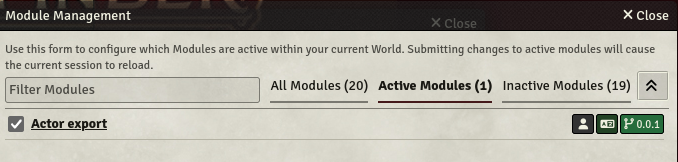
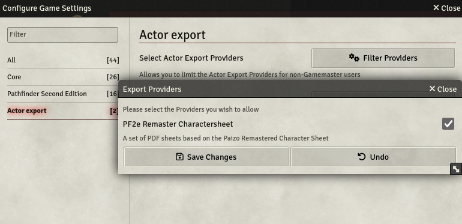
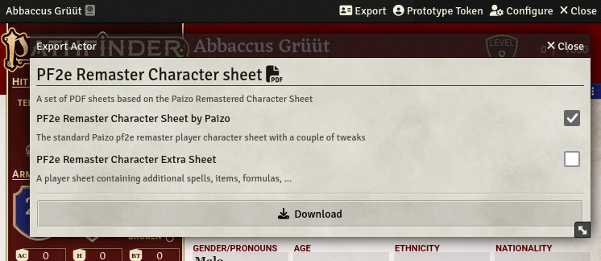

# Export Actors

![badge_version] ![badge_issues] ![badge_downloads]

![badge_fvtt_versions] ![badge_foundry_installs]

![badge_mastodon] ![badge_discord]

A system agnostic Foundry VTT module which allows exporting your actors in a variety of formats through the use of (custom) providers.

Feel free to join [#actor-export-general:matrix.elaba.net](https://matrix.to/#/#actor-export-general:matrix.elaba.net), [#actor-export-pf2e:matrix.elaba.net](https://matrix.to/#/#actor-export-pf2e:matrix.elaba.net), [#actor-export-dnd5e:matrix.elaba.net](https://matrix.to/#/#actor-export-dnd5e:matrix.elaba.net) using a [Matrix client](https://matrix.org/ecosystem/clients/)
for help.

## Installation

Install this module through the Foundry VTT Administrator interface, by searching for `actor-export`, or by specifying the following URL: `https://github.com/bushvin/actor-export/releases/latest/download/module.json`

As a Gamemaster, activate the `actor-export` module in your world.

## Usage

### Configuration

#### Actor Export Provider selection

As a Gamemaster you have the option to select providers which can be used by your players. Only providers which match your game system's requirements will be available for selection.

Selecting providers will enable/disable access to certain providers to your players.

#### Custom Providers

Additionally to the standard providers, a Gamemaster can create their own provider and add it through the settings page. More on this in the Wiki (TBD).

### Exporting Actors

Open your character from the *Actors* page and click the `Export` button. Then select the files you wish to export as and click `Download`.

Depending on the number of and complexity of the selected files, the export might take some time, so be patient when clicking `Download`.

## Providers

A provider is a set of (javascript) instructions to be interpreted in order to generate files of various types (ex. pdf, ods, png, ...) A provider can offer the generation of one or more files.

### Current providers

Name | System | Description | Type | Author(s)
--- | --- | --- | --- | ---
Dungeons & Dragons 5th edition Character sheets | dnd5e (3.0.0+) | A set of PDF sheets based on the Official D&D5e Character Sheets by WoTC | pdf | [bushvin](https://github.com/bushvin)
PF2e Scribe Generator | pf2e (5.9.0+) | A set of templates to generate scribe.pf2.tools markdown | scribe.pf2.tools | [bushvin](https://github.com/bushvin)
[Bushvin's PF2e Remaster Character sheet](https://github.com/bushvin/actor-export/wiki/pf2e-remaster) (deprecated) | pf2e (5.9.0+) | A set of PDF sheets based on the Paizo Remastered Character Sheet | pdf | [bushvin](https://github.com/bushvin)
[Bushvin's modified PF2e Remaster Character sheet](https://github.com/bushvin/actor-export/wiki/pf2e-remaster-bushvin) | pf2e (5.9.0+) | A set of modified charactersheets based on Paizo's | pdf | [bushvin](https://github.com/bushvin)
[PF2e Remaster Character sheet (original)](https://github.com/bushvin/actor-export/wiki/pf2e-remaster-paizo) | pf2e (5.9.0+) | The official Paizo Remastered Character Sheet | pdf | [bushvin](https://github.com/bushvin)

For more, please refer to the [Provider](https://github.com/bushvin/actor-export/wiki#providers) section of the [wiki](https://github.com/bushvin/actor-export/wiki)

## Change notes

See [CHANGELOG.md](CHANGELOG.md)

[badge_version]: https://img.shields.io/github/v/tag/bushvin/actor-export?label=Version&style=flat-square&color=2577a1

[badge_issues]: https://img.shields.io/github/issues/bushvin/actor-export?style=flat-square
[badge_downloads]: https://img.shields.io/github/downloads/bushvin/actor-export/actor-export.zip?label=Downloads&style=flat-square&color=9b43a8

[badge_fvtt_versions]: https://img.shields.io/endpoint?url=https://foundryshields.com/version?url=https://github.com/bushvin/actor-export/releases/latest/download/module.json&style=flat-square&color=ff6400

[badge_mastodon]: https://img.shields.io/mastodon/follow/1084764?domain=https%3A%2F%2Fmastodon.social&logo=mastodon&logoColor=white&style=flat-square&label=%40bushvin%40mastodon.social

[badge_discord]: https://img.shields.io/discord/1194592282205237290?style=flat-square&logo=discord

[badge_foundry_installs]: https://img.shields.io/badge/dynamic/json?url=https%3A%2F%2Fforge-vtt.com%2Fapi%2Fbazaar%2Fpackage%2Factor-export&query=package.installs&style=flat-square&label=Foundry%20Installs
